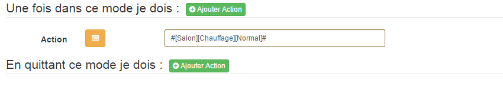

Actions
=====

Il est possible d'effectuer une action lors d'un passage dans un mode.
Pour en ajouter une il suffit de cliquer sur "Ajouter action" puis de sélectionner l'action souhaitée.

Il est possible de définir les actions en entrant dans un modes et en sortant du mode. 
