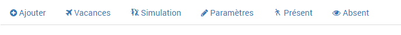
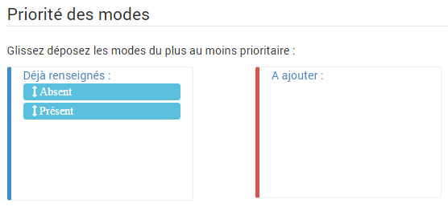

Configuration 
=====

- Une fois le plugin activé rendez-vous dans Plugins / Organisation / Présence pour ajouter un nouveau module.
- Cliquez sur le bouton à gauche : "Ajouter".

Dans le nouvel équipement :

	1 - Sélectionnez l'objet parent et cochez les cases "Activer" et "Visible"

	2 - Cliquez sur ajouter pour créer un nouveau mode.

- Après avoir enregistré il est nécessaire de configurer l'ordre des modes en haut à droite. Pour cela glissez déposez les modes suivant l'état voulu puis sauvegarder.

> **Attention :**

>Si l'option `Garder le cache lors de l'enregistrement` présentée dans Programmations n'est pas activée où si le déclencheur n'est pas encore connu en cache il faut que ceux-ci changent d'états afin d'être pris en compte. C'est à dire que l'état ne le prendra en compte qu'apès 2 changements. 
