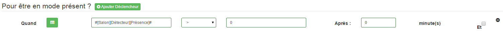

Déclencheurs
=====

Les déclencheurs permettent d'activer un mode. Le mode sera validé seulement si le déclencheur est dans l'état programmé depuis le temps choisi.

Pour ajouter un déclencheur il suffit de cliquer sur "Ajouter déclencheur" puis de sélectionner l'appareil servant de déclencheur, l'état de validation et le temps.

Plusieurs états de comparaison sont disponibles :

- `<` correspond à inférieur à
- `=` L'état du déclencheur doit être égal à la valeur renseignée
- `>` correspond à supérieur à
- `!=` correspons à différent de.

Il est possible de combiner des déclencheurs en utilisant l'opération "Et". A ce moment il faudra que les conditions des déclencheurs "Et" soient toutes validées pour que le mode soit activé.

Exemples :

Si _1==1_ *ET* _2==2_ *OU* _1==2_ *SEUL* _0==2_ ici les conditions ET sont remplies, la OU non et la SEUL non donc pas de déclenchement

Si _1==1_ *ET* _2==2_ *OU* _1==1_ *SEUL* _0==2_ ici les conditions ET sont remplies, la OU est ok la SEUL non donc il y a déclenchement

Si _1==1_ *ET* _2==2_ *OU* _1==2_ *SEUL* _0==0_ ici les conditions ET sont remplies, la OU non et la SEUL oui donc il y a déclenchement

Si _1==2_ *ET* _1==2_ *OU* _1==1_ *SEUL* _0==2_ ici les conditions ET ne sont pas remplies, la OU oui et la SEUL non donc il n'y a pas de déclenchement.
