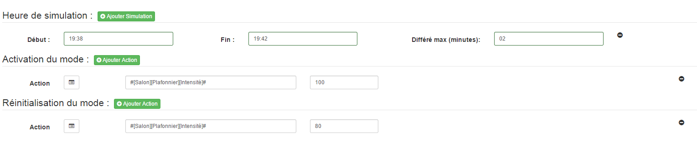

Simulation
=====

L'onglet Simulation vous permet de gérer des actions de simulation pour les modes choisis.
Il se décompose en 3 parties :

- Heure de simulation :
Cette partie permet de programmer les plages de fonctionnement de la simulation.
Chaque simulation possède une heure de début, une heure de fin et un interval de différé.
Le différé est une plage variable en minute de déclenchement de la simulation. Une plage de 15 minutes par exemple indique que la simulation pourra démarrer entre 15h00 et 15h15 aléatoirement chaque jour.

- Activation du mode :
Il s'agit des actions qui seront exécutés lors du démarrage de la simulation. Cela peut être des actions / scénarios.

- Désactivation du mode :
Même chose mais a la fin de la simulation.

