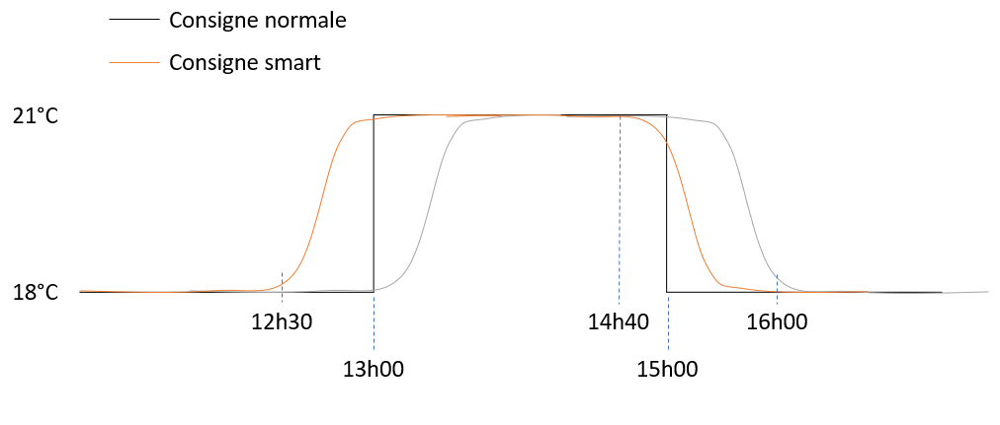
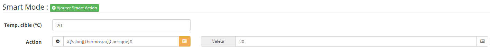

=====
La fonction smart va vous permettre d'anticiper le passage des modes en fonction de l'historique. 
Le plugin va scruter les changements d'états sur les précédentes semaines et déterminer les probabilités de passage dans l'état. 
L'avantage principal est la gestion du chauffage afin d'avoir une pièce à température lors de l'arrivée. 

Pour activer la fonction : 
- Se rendre sur l'onglet Programmation de l'objet et activer le mode smart.
- Renseigner le thermostat sur lequel sera basé les coefficients. 
- Sur les modes pour lesquels vous voulez utiliser la fonction renseigner une température cible a utiliser. 
- Renseigner les actions qui seront exécutées. 

L'information Mode doit être historisée (Activée par défaut).
Allouer un délai d'un mois d'historique avant de voir les anticipations.

