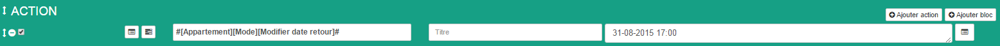

Vacance
=====
Le mode Vacances est un peu différent. Il possède 2 types d'actions.

- Les actions "Au départ" : Ces actions sont exécutées après l'activation du mode Vacances. Il est possible de temporiser le déclenchement grâce au minuteur.
- Les actions "A l'arrivée" : Ces actions sont exécutées avant le retour programmé dans la zone "Date de retour". Il est possible de choisir combien de temps avant cette date les actions sont déclenchées.

La date de retour se change depuis :

- La programmation de l'objet.
- Le widget.
- Les scénarios (Attention ! Le format renseigné dans la partie message doit être le suivant : JJ-MM-AAAA HH:MM)

Pour la modifier depuis le widget, il suffit de cliquer sur le mode Vacances puis de cliquer sur la date qui s'affiche. 
